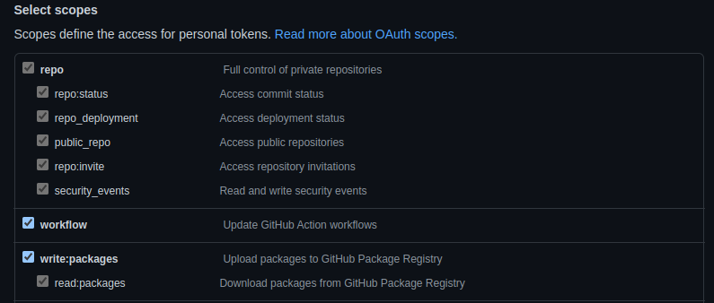
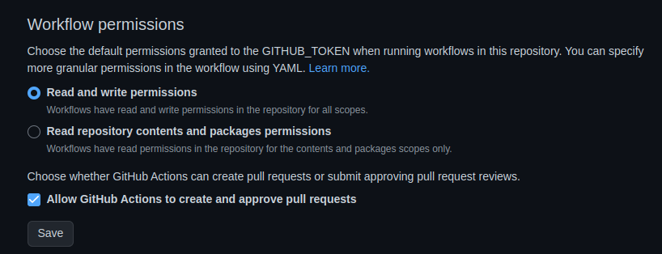

gitops-test-env
=========

**TLDR**: This repository creates a local sandbox environment with a kubernetes cluster and Argo CD and showcases various possibilities of managing multiple stages of an application and how to promote new releases.

Table of Contents
=================

* [Getting started](#getting-started)
  * [Prerequisites](#prerequisites)
  * [Installation Steps](#installation-steps)
* [Accessing Argo CD and deployed applications](#accessing-argo-cd-and-deployed-applications)
* [Usage Guides](#usage-guides)


# Getting started

## Prerequisites
* Only tested on Fedora and Ubuntu
* Install the following tools:
  * [Docker](https://docs.docker.com/engine/install/) with capability of [running Docker without sudo](https://docs.docker.com/engine/install/linux-postinstall/#manage-docker-as-a-non-root-user)
  * [kubectl](https://kubernetes.io/docs/tasks/tools/install-kubectl-linux/#install-kubectl-on-linux)
  * [helm](https://helm.sh/docs/intro/install/)
  * [k3d](https://k3d.io/v5.4.8/#installation) (version 5.x)

## Installation Steps
Follow all these steps in the exact order. You wil have to switch between GitHub settings and your locally cloned
fork a few times.

### In GitHub
* Fork this repository
* Go to [https://github.com/settings/tokens](https://github.com/settings/tokens) and click on `Generate new token (Classic)`. Give it the following scopes, save it and copy your generated token (we will need it in the next few steps):

* Go to [https://github.com/USERNAME/gitops-test-env/settings/secrets/actions](https://github.com/USERNAME/gitops-test-env/settings/secrets/actions) and create a `Repository secret` called `RENOVATE_TOKEN`. Use the previously generated Token as the value.
* Go to [https://github.com/USERNAME/gitops-test-env/settings/actions](https://github.com/USERNAME/gitops-test-env/settings/actions) and set the following Actions settings:


### On your computer
* Clone your fork
* **In the root path** of the cloned fork, run the following command _(renames all occurences of the original repository or ghcr to yours)_:
```bash
# your github username in lowercase (e.g.: your name is FooBar, then type in GH_USER_NAME=foobar)
GH_USER_NAME=<your-github-user-name>
grep -rl --exclude-dir=.git lukma99 . | xargs sed -i "s/lukma99/${GH_USER_NAME}/g"
```
* Go to `.github/renovate.js` and replace `username` and `gitAuthor` with your username/email
* Commit and push your changes

### In GitHub
* Go to GitHub Actions and run the job `Build and Push Docker Image` with the tag `1.0.0` _(because all manifests are initially
  set to this version)_
* After the first pipeline run of `Build and Push Docker Image`, change the ghcr visibility to `public` here: [`https://github.com/users/USERNAME/packages/container/gitops-test-env/settings`](https://github.com/users/USERNAME/packages/container/gitops-test-env/settings)

### On your computer
* **In the root path** of the cloned fork, run `./scripts/setup_cluster.sh`. This will install a local k3d cluster with Argo CD ready to use with this project. During the script it will ask you to enter your GitHub Username and previously generated token.
* Go to [`http://localhost:8080/argocd`](http://localhost:8080/argocd). Wait a few minutes for first sync or press `Sync now`


# Accessing Argo CD and deployed applications
_Port can be changed by changing `INGRESS_PORT` in `./scripts/setup_cluster.sh`_

Argo CD:
* [`http://localhost:8080/argocd`](http://localhost:8080/argocd)

Manual Deployment:
* Dev: [`http://localhost:8080`](http://localhost:8080)
* Staging: [`http://localhost:8080`](http://localhost:8080)
* Prod: [`http://localhost:8080`](http://localhost:8080)


CI-Pipeline Deployment:
* Dev: [`http://localhost:8080`](http://localhost:8080)
* Staging: [`http://localhost:8080`](http://localhost:8080)
* Prod: [`http://localhost:8080`](http://localhost:8080)


Image-Updater Deployment:
* Dev: [`http://localhost:8080`](http://localhost:8080)
* Staging: [`http://localhost:8080`](http://localhost:8080)
* Prod: [`http://localhost:8080`](http://localhost:8080)


Dependency-Bot Deployment:
* Dev: [`http://localhost:8080`](http://localhost:8080)
* Staging: [`http://localhost:8080`](http://localhost:8080)
* Prod: [`http://localhost:8080`](http://localhost:8080)


Preview-Environments:
* [`http://localhost:8080/preview-<BRANCH_NAME>-<PR_NUMBER>`](http://localhost:8080/preview-<BRANCH_NAME>-<PR_NUMBER>) 
_(e.g.: Source-Branch `feature/mytest`) on PR `42` will become `http://localhost:8080/preview-feature-mytest-42`.
Remember adding the `preview` label to the PR._


# Usage Guides
See individual usage guides for the release promotion mechanisms in the `docs` folder:
* [Manual Deployment](docs/01_manual.md)
* [CI-Pipeline](docs/02_ci-pipeline.md)
* [Image-Updater](docs/03_image-updater.md)
* [Dependency-Bot](docs/04_renovate-bot.md)
* [Preview-Environments](docs/05_preview-environments.md)
