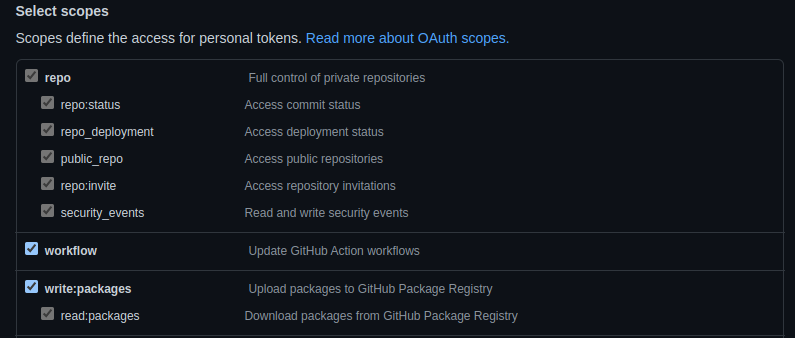
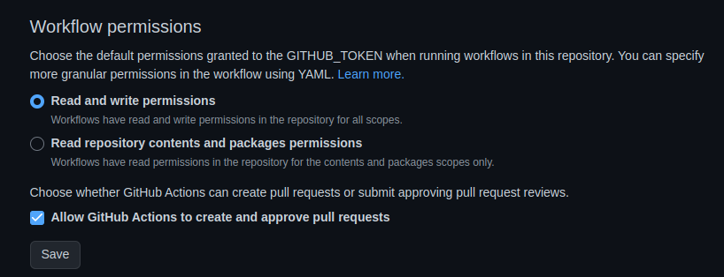

# gitops-test-env

**TLDR**: This repository creates a local sandbox environment with a kubernetes cluster and Argo CD and showcases various possibilities of managing multiple stages of an application and how to promote new releases.

## Getting started

### Prerequisites
* Only tested on Fedora and Ubuntu
* Install the following tools:
  * [Docker](https://docs.docker.com/engine/install/) with capability of [running Docker without sudo](https://docs.docker.com/engine/install/linux-postinstall/#manage-docker-as-a-non-root-user)
  * [kubectl](https://kubernetes.io/docs/tasks/tools/install-kubectl-linux/#install-kubectl-on-linux)
  * [helm](https://helm.sh/docs/intro/install/)
  * [k3d](https://k3d.io/v5.4.8/#installation) (version 5.x)

### Installation Steps
## In GitHub:
* Fork this repository
* Go to [https://github.com/settings/tokens](https://github.com/settings/tokens) and click on `Generate new token (Classic)`. Give it the following scopes, save it and copy your generated token (we will need it in the next few steps):

* Go to [https://github.com/USERNAME/gitops-test-env/settings/secrets/actions](https://github.com/USERNAME/gitops-test-env/settings/secrets/actions) and create a `Repository secret` called `RENOVATE_TOKEN`. Use the previously generated Token as the value.
* Go to [https://github.com/USERNAME/gitops-test-env/settings/actions](https://github.com/USERNAME/gitops-test-env/settings/actions) and set the following Actions settings:

* After the first pipeline run of "Docker Image Push", change the ghcr visibility to `public`

## On your computer:
* Clone your fork
* **In the root path** of the cloned fork, run the following command _(renames all occurences of the original repository or ghcr to yours)_:
```bash
# your github username in lowercase (e.g.: your name is FooBar, then type in GH_USER_NAME=foobar)
GH_USER_NAME=<your-github-user-name>
grep -rl --exclude-dir=.git lukma99 . | xargs sed -i "s/lukma99/${GH_USER_NAME}/g"
```
* **In the root path** of the cloned fork, run `./scripts/setup_cluster.sh`. This will install a local k3d cluster with Argo CD ready to use with this project. During the script it will ask you to enter your GitHub Username and previously generated token.
